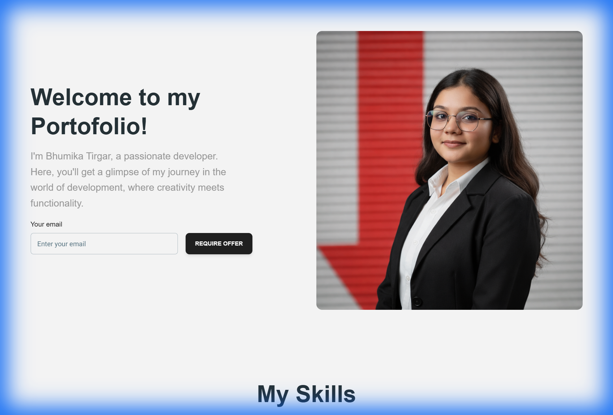

# AI & ML Personal Portfolio

A professional portfolio website showcasing expertise in Computer Vision, Natural Language Processing, and Backend Development. Built with Next.js, Tailwind CSS, and Material Tailwind.



## Featured Projects

1. **Agentic AI: RAG-Based SQL Query Generator** - Autonomous AI system that transforms natural language into optimized SQL.
2. **AI Stock Trading Signal Generator** - Machine learning system for market analysis and trading signal generation.
3. **LJ Canteen – Food Delivery Web Application** - Django-based platform for canteen management and food delivery.

## Tech Stack

- **Frontend:** Next.js, React, Tailwind CSS, Material Tailwind
- **Backend:** Python (Django, Flask), PostgreSQL, MySQL
- **AI/ML:** LangChain, Scikit-Learn, Pandas, SQLCoder

## Getting Started

1. Clone the repository:
   ```bash
   git clone https://github.com/tirgarbhumika55-png/my-portfolio.git
   ```
2. Install dependencies:
   ```bash
   npm install
   ```
3. Run the development server:
   ```bash
   npm run dev
   ```

## Connect with me

- **GitHub:** [tirgarbhumika55-png](https://github.com/tirgarbhumika55-png)
